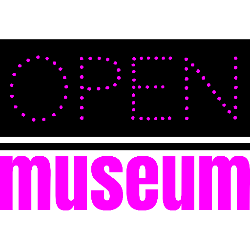

# [open-museum.ch](https://github.com/open-museum/open-museum.ch/)

This repo makes all the magic of [open-museum.ch](https://open-museum.ch/):

- [Sapper/Svelte](https://github.com/open-museum/web), [d3shooter](https://github.com/open-museum/d3shooter) and [Janus Gateway](https://github.com/open-museum/janus-gateway-docker) powered front end of [open-museum.ch](https://open-museum.ch/)
- [Omeka S](https://github.com/open-museum/omeka-s-docker) cultural heritage object management system [collections.open-museum.ch](https://collections.open-museum.ch/)
- Reverse proxy from [Traefik](https://docs.traefik.io/) for the routing and securing of all traffic

[](https://open-museum.github.io/open-museum.ch/)

[](https://github.com/open-museum/open-museum.ch/issues)
[](https://github.com/open-museum/open-museum.ch/network)
[](https://github.com/open-museum/open-museum.ch/stargazers)
[](https://github.com/open-museum/open-museum.ch/blob/master/LICENSE.md)

## Installation

Install [Docker](https://www.docker.com/).

Copy and edit `.env.example`

```bash
cp .env.example .env
nano .env
```

Create file stubs for Traefik

```bash
touch traefik/acme.json
touch traefik/traefik.log
```

Export environment variables and use `setup.sh` to create `database.ini` and set permissions

```bash
source .env
bash setup.sh
```

## Usage

```bash
docker-compose up -d
```

You might need to fix some permissions to make Traefik and Omeka s work.

```bash
chmod 600 traefik/acme.json
chown -R www-data:www-data omeka-web
```

## Support

This project is maintained by [@open-museum](https://github.com/open-museum). Please understand that we won't be able to provide individual support via email. We also believe that help is much more valuable if it's shared publicly, so that more people can benefit from it.

| Type                   | Platforms                                                    |
| ---------------------- | ------------------------------------------------------------ |
| 🚨 **Bug Reports**      | [GitHub Issue Tracker](https://github.com/open-museum/open-museum.ch/issues) |
| 🎁 **Feature Requests** | [GitHub Issue Tracker](https://github.com/open-museum/open-museum.ch/issues) |
| 🛡 **Report a security vulnerability**      | [GitHub Issue Tracker](https://github.com/open-museum/open-museum.ch/issues) |

## Roadmap

Changes are planned. A roadmap will be published in time.

## Contributing

Please read [CONTRIBUTING.md](CONTRIBUTING.md) for details on our code of conduct, and the process for submitting pull requests to us.

## Versioning

We use [SemVer](http://semver.org/) for versioning. For the versions available, see the [tags on this repository](https://github.com/open-museum/open-museum.ch/tags).

## Authors and acknowledgment

- **Moritz Mähr** - _Initial work_ - [maehr](https://github.com/maehr)

See also the list of [contributors](https://github.com/open-museum/open-museum.ch/graphs/contributors) who participated in this project.

## License

This project is licensed under the MIT License - see the [LICENSE.md](LICENSE.md) file for details
